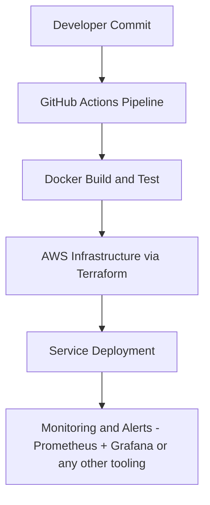

# DevOps Reference Implementations

Welcome to our DevOps Implementations Examples — a collection of practical implementations that demonstrate some of our experience in cloud infrastructure, automation, CI/CD, containerization, and system monitoring. There are so many ways you can implement a solution, these are just some basic ways to reference, for more advanced implementations and for any services within the realm of DevOps and Site Reliability Engineering please reach out to us.

These repositories showcase real-world setups and anonymized client-like scenarios that reflect how modern DevOps practices can streamline development and deployment pipelines.

---

## About This Repository

This repository serves as a central hub for all our DevOps demonstration projects.  
Each folder or linked repository represents a different aspect of the DevOps lifecycle — from infrastructure provisioning and containerization to monitoring and automation.

All examples are:
- Based on **some client requirements and example projects people have asked before** (all obfuscated)
- Built using **industry-standard tools and workflows**
- For reference only, they might not be configured and deployed as they are in this repository.
- Documented clearly to help anyone understand or replicate them

---

## Implementations Overview

| Category | Project | Description | Tools & Technologies |
|-----------|----------|--------------|----------------------|
| Containerization | [Dockerized Flask App](./dockerized-flask-app) | A simple Flask web app running in Docker with PostgreSQL | Docker, Docker Compose, Flask, PostgreSQL |
| CI/CD Automation | [CI/CD Pipeline Demo](./ci-cd-demo-github-actions) | End-to-end automated build and deploy pipeline | GitHub Actions, Docker |
| Infrastructure as Code | [Terraform AWS Setup](./terraform-aws-setup) | Infrastructure provisioning using Terraform | Terraform, AWS |
| Kubernetes and EKS | [Kubernetes and EKS Terraform Setup](./kubernetes-eks) | Example AWS EKS and Kubernetes manifests | Terraform, AWS, Kubernetes, YAML |
| Monitoring & Observability | [Prometheus + Grafana Demo](./grafana-prometheus-monitoring) | Container metrics collection and dashboard visualization | Prometheus, Grafana, Docker, AWS, Terraform, Kubernetes, EKS and IRSA|
| Serverless Architecture | [Serverless API Example](./serverless-api-demo) | Cost-efficient, event-driven architecture using AWS Lambda | AWS Lambda, API Gateway, Terraform |

---

## Core Skills Demonstrated

- **CI/CD Pipeline Automation** – Streamlined build, test, and deploy workflows using GitHub Actions and Jenkins.  
- **Containerization** – Efficient environment setup using Docker and Kubernetes.  
- **Infrastructure as Code (IaC)** – Scalable cloud deployments managed through Terraform and AWS.  
- **Monitoring & Logging** – Implemented Prometheus, Grafana, and ELK Stack configurations.  
- **Serverless Solutions** – Deployed lightweight, cost-effective architectures on AWS.  
- **We will keep updating this repositories as we find time**

---

## Example Flow 

## Purpose

The goal of this repository is to:

Showcase the range of DevOps capabilities — from automation to observability.

Serve as a reference base for potential client projects.

Reflect a professional and scalable DevOps mindset applicable to businesses of any size.

## About Devfero

We are a team of development and DevOps enthusiasts, building a business focused on delivering automation-driven solutions that improve deployment efficiency, reliability, and scalability for clients.

We are a passionate team of developers and designers crafting exceptional digital experiences that drive growth and innovation for businesses worldwide.

Each project here is part of our mission to bridge business understanding with technical execution, ensuring that every implementation aligns with operational and strategic goals.

These implementations are not exhaustive and do not represent all the tools we work with*. We work on a wide range of tooling and provide solutions to our clients. 

## Tools we work with (not an exhaustive list) 
### Cloud Providers
- AWS
- GCP
- Azure
- and more, reach out to us if you need help with anything else.

### Infrastructure as Code
- Terraform
- Cloud Formation
- GCP Deployment Manager
- Azure Resource Manager

### Containerization
- Docker
- Docker Compose
- Rocket

### Scripting
- Bash
- Python
- NodeJS
- We don't shy away from the rest. The above are just our recommended scripting suits.

### Service Orchestration
- Kubernetes and it's cloud flavors (EKS, GKE, AKS)
- Docker Swarm
- Please reach out with your use cases for other tools like OpenShift.

### Configuration Management
- Ansible
- Please reach out to find more about others like Chef and Puppet.

### Monitoring and Alerting
- Grafana
- Prometheus
- Loki
- Fluentd
- ELK stack
- Alert Manager
- Datadog
- New Relic
- Please reach out to find out any other tools you prefer or use currently.

### CI/CD tools
- Github Actions
- Gitlab Pipelines
- Bitbucket Pipelines
- Azure DevOps
- Jenkins
- ... and more.

## Contact

If you’d like to collaborate or discuss a potential project, feel free to reach out:

Email: [info@devfero.com, dev@devfero.com]

GitHub: https://github.com/dev-devfero
